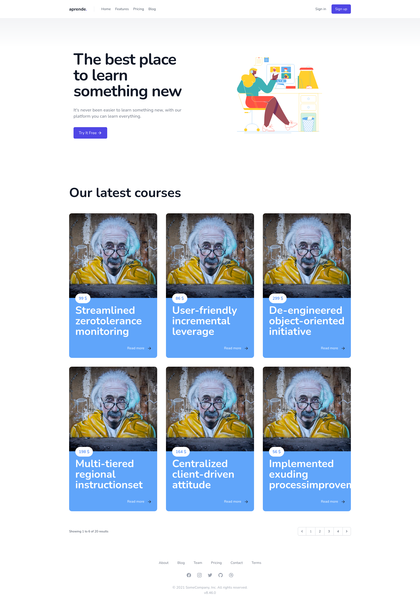
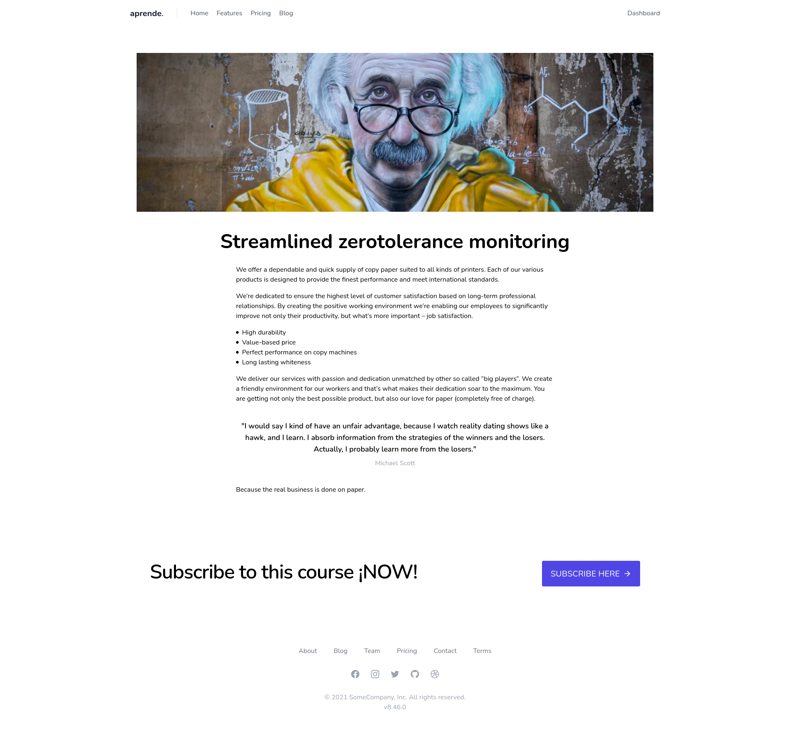
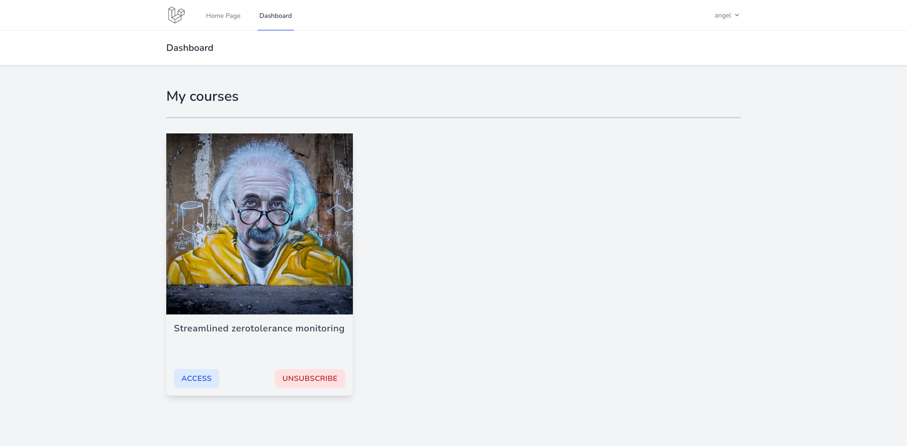
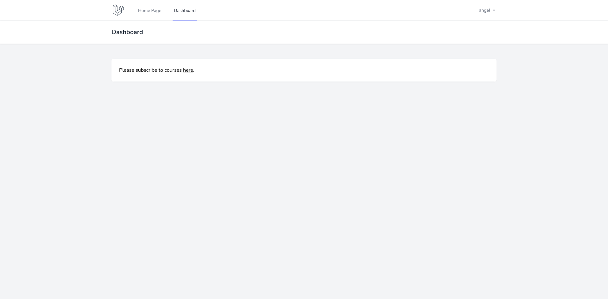

## aprende

[](https://github.com/abr4xas/aprende/actions/workflows/laravel.yml)


this is a proof of concept application


### local development
---

if you want to work on your local machine you can do that using docker (i've already provide a docker-compose file)

to start the proyect with docker you need to run this commands:

```bash
docker-compose up -d
```

you need to know the mysql IP address to be able to run the migrations

```bash
docker exec aprende-webserver ping mysq
```

if you need to fix the storage permissions you need to access the container with:

```bash
docker-compose exec php-fpm bash
```
then, you can run any linux command...


#### run laravel
---

you only need to run this commands:


```bash
$ composer install
$ php artisan migrate:fresh --seed
$ yarn install
$ yarn run dev
```

test user

```
john.doe@domain.tld
secret
```


done! :)


### test

---

there is 4 specific test for this app:

```bash
User (Tests\Unit\User)
 ✔ It user can subscribe to course
 ✔ It user have zero subscriptions

Basic (Tests\Feature\Basic)
 ✔ A welcome view can be rendered
 ✔ Home page
```

if you want to run those test you only need to run this command:

```bash
$ ./vendor/bin/phpunit --filter BasicTest
$ ./vendor/bin/phpunit --filter UserTest
```

> note: you can run all test with `composer test`


### screenshots

___





